# Movie Recommender (MovieLens 1M)

A two-stage recommender system, built end-to-end on the MovieLens 1M
dataset: candidate **retrieval** (a PyTorch two-tower model + FAISS,
optimized for recall) followed by **ranking** (LightGBM LambdaRank,
optimized for NDCG), evaluated with a leakage-free per-user temporal split.
Every number in this README comes from an actual run of the evaluation
scripts in this repo — see `reports/results.md`.

## Problem statement

Given a user's past positive interactions, return a ranked top-10 list of
movies they haven't seen yet that they're likely to enjoy next. This is
framed as **implicit-feedback, next-item recommendation**: the only signal
used is "did the user positively interact with this movie" (rating >= 4),
and the model is evaluated on whether it can predict the *next* movie a
user watches, given everything they'd watched before — the realistic
version of the recommendation problem, since production systems observe
clicks/watches, not clean explicit preferences.

## Architecture

```mermaid
flowchart LR
    subgraph data["Data"]
        raw["MovieLens 1M\n(ratings, movies, users)"]
        split["Implicit feedback (rating >= 4)\n+ per-user temporal split"]
        raw --> split
    end

    subgraph stage1["Stage 1: Retrieval (recall-optimized)"]
        twotower["Two-Tower Model (PyTorch)\nUser Tower | Item Tower"]
        faiss["FAISS index\n(item embeddings)"]
        candidates["Top-500 candidates\nper user"]
        twotower --> faiss
        faiss --> candidates
    end

    subgraph stage2["Stage 2: Ranking (precision-optimized)"]
        features["User / item / cross features\n(popularity, avg rating,\ngenre overlap, retrieval score)"]
        lgbm["LightGBM LambdaRank"]
        top10["Top-10 recommendations"]
        candidates --> features
        features --> lgbm
        lgbm --> top10
    end

    subgraph serve["Serving"]
        api["FastAPI\n/recommend/{user_id}"]
        ui["Streamlit demo"]
        top10 --> api
        api --> ui
    end

    split --> twotower
```



Two baselines (global **popularity** and **ALS** matrix factorization) are
evaluated alongside every stage for comparison — see Results below.

## Dataset

[MovieLens 1M](https://files.grouplens.org/datasets/movielens/ml-1m.zip):
1,000,209 ratings from 6,040 users on 3,883 movies (`ratings.dat`,
`movies.dat`, `users.dat`; `::`-separated, latin-1 encoded). Genres are
parsed into an 18-way multi-hot vector and release year is parsed out of
each title (e.g. "Toy Story (1995)"). `scripts/run_download.py` downloads
and extracts it into `data/raw/` (gitignored — never commit the dataset).

**Implicit feedback + temporal split** (see `docs/DECISIONS.md` for the
full rationale): a rating >= 4 counts as a positive interaction; everything
else is treated as "not known to be positive," never as an explicit
negative. For each user, interactions are sorted by timestamp and the last
positive goes to **test**, the second-to-last to **val**, and the rest to
**train** (leave-two-out) — never a random split, since that would let the
model see the future.

## How to run

> **macOS only:** LightGBM's native library needs Homebrew's `libomp`,
> which `pip` doesn't install: run `brew install libomp` once before
> `make train-ranking`. See `docs/IMPLEMENTATION_LOG.md` (Phase 3, Step 8)
> for why this is easy to miss.

```bash
make setup           # create .venv and install requirements.txt
make download-data   # download MovieLens 1M, build implicit + temporal split
make test            # run unit tests (metrics)
make eda             # generate EDA figures into reports/figures/
make baselines       # fit + evaluate popularity and ALS baselines
make train-retrieval # train the two-tower retrieval model
make eval-retrieval  # evaluate retrieval Recall@500 vs baselines
make train-ranking   # build ranker training data + train LightGBM LambdaRank
make eval-ranking    # evaluate the full retrieval+ranking pipeline on test
make api             # serve the FastAPI demo at http://localhost:8000/docs
make demo            # launch the Streamlit demo at http://localhost:8501
```

`make all` runs every step above except `api`/`demo` (which are long-running
servers, not one-shot batch jobs) end to end on a clean checkout. Every
script reads its paths, seed (42), and hyperparameters from the single
`config.yaml` — nothing is hardcoded in the code.

## Results

Full val+test breakdown in `reports/results.md`; figures in
`reports/figures/`. All numbers below are from the **test** split.

**Stage 1 — Retrieval (Recall@500: is the right movie somewhere in the
candidate pool at all?)**

| Model | Recall@500 | NDCG@500 | Coverage@500 |
|---|---|---|---|
| Popularity | 0.5647 | 0.0970 | 0.3544 |
| ALS | 0.7502 | 0.1402 | 0.8290 |
| Two-Tower Retrieval | 0.6507 | 0.1061 | 1.0000 |

The two-tower retriever beats popularity but not ALS here — expected on a
small, dense dataset like MovieLens 1M, where ALS's exact matrix
factorization is hard to beat and the two-tower's real advantages (item
cold start, scaling to huge catalogs) aren't exercised. Full explanation in
`docs/DECISIONS.md` ("The two-tower retriever underperforms ALS on
Recall@500"). Feeding the user tower a real train-history genre-preference
vector (instead of relying only on the learned `user_id` embedding)
improved this from 0.6404 to 0.6507.

**Stage 2 — Final Top-10 (Recall@10 / NDCG@10: precision at the list a user
actually sees)**

| Model | Recall@10 | NDCG@10 | Coverage@10 |
|---|---|---|---|
| Popularity | 0.0393 | 0.0193 | 0.0296 |
| ALS | 0.0654 | 0.0329 | 0.4378 |
| Retrieval-only (raw top-10) | 0.0318 | 0.0140 | 0.9593 |
| **Retrieval + Ranking (full pipeline)** | **0.0828** | **0.0423** | 0.5228 |

The full pipeline beats every other model, including ALS, by a wide margin
(+27% Recall@10, +29% NDCG@10) — even though retrieval alone loses to ALS
on Recall@500, and taking retrieval's raw top-10 directly is the *worst* of
the four. The two-tower model is trained/evaluated for Recall@500, not
top-10 precision; the ranker's job is exactly to do that precision
reordering, with features retrieval never had access to. Full explanation
in `docs/DECISIONS.md` ("Why retrieval-only top-10 is the worst of the four
models, yet the full pipeline is the best").

**Why the absolute numbers (8%, 4%) look low:** this evaluates against the
*entire* catalog (~3,700+ unseen movies), not a small sampled set of
negatives the way many published benchmarks do — a random recommender would
score ~0.27% at this task, so 8.28% is ~30x better than chance. See
`docs/DECISIONS.md` ("Why the absolute Recall@10 (8%) and NDCG@10 (4%) look
low") for the full breakdown, including why numbers like 0.6-0.7 in some
papers use an easier, non-comparable evaluation protocol.

## Demo API

`src/pipeline.py` loads every trained artifact once and reuses the exact
`build_candidate_table()` function from Phase 3's evaluation — the API's
recommendations come from the identical code path that was measured
offline, not a reimplementation (see `docs/DECISIONS.md`).

- `GET /recommend/{user_id}?k=10` — ranked titles/genres/scores.
- `GET /user/{user_id}/history?k=20` — movies the user has liked.
- An unrecognized `user_id` returns `is_cold_start: true` with
  popularity-based recommendations, never an error.

Real example: user 1's history is entirely Disney/Pixar animated films
(Pocahontas, Hercules, Mulan, A Bug's Life, Antz); `/recommend/1` returns
Lion King, Little Mermaid, Charlotte's Web, Pinocchio, Fantasia —
genre-consistent with that history. Per-request latency is logged via
`time.perf_counter()`: ~85-125ms for a known-user recommendation after
warmup, sub-millisecond for cold-start/history lookups. No Docker, Redis,
or cloud deployment — everything runs as a local process.
`app_streamlit.py` is a small optional UI showing history next to
recommendations, calling `RecommenderPipeline` directly.

## Design decisions

Every significant decision — why rating >= 4 as the positive threshold, why
a temporal (not random) split with exactly one held-out item per split, why
two stages instead of one model, why in-batch negatives, why FAISS, why
LambdaRank instead of classification, how leakage is prevented in ranker
features, how cold start is handled, and the two empirical findings above —
is written up with alternatives considered and trade-offs in
**`docs/DECISIONS.md`**, which also has a running Interview Questions
section built from real questions asked while developing this project.
**`docs/IMPLEMENTATION_LOG.md`** has the full chronological build log,
including every bug hit and how it was fixed (pandas warnings, macOS
`faiss`+`torch`+`lightgbm` native-library conflicts, an OpenBLAS threading
warning) with real numbers at each step.

## Limitations & future work

- **New users get no personalization.** An unrecognized `user_id` falls
  back to global popularity — there's no learned embedding for a user the
  model never trained on, since the two-tower model's `user_id` embedding
  table is a fixed size set at training time. Real fixes: periodic
  retraining to absorb new users, a shared "unknown user" embedding slot
  combined with real demographics, or (once a new user has a few ratings)
  using the average of their liked items' `ItemTower` embeddings as an ad
  hoc query vector — none of which are implemented here.
- **Two-tower retrieval underperforms ALS at this dataset's scale**
  (Recall@500 0.65 vs 0.75), for reasons detailed in `docs/DECISIONS.md` —
  its real advantages (item cold start, scaling to huge catalogs) aren't
  exercised by a ~3,700-item, fully-observed dataset like ML-1M.
  A from-scratch production system at this scale could reasonably use ALS
  (or ALS embeddings as a two-tower input feature) for retrieval instead.
  Even fully aware of this, the two-tower approach was kept and evaluated
  honestly to demonstrate the two-stage architecture pattern used in
  large-scale production recommenders, where those advantages matter.
- **No separate ranker validation set.** The `val` split is used both to
  label the ranker's training data and implicitly as its only held-out
  signal — there's no fourth split for early-stopping/hyperparameter
  search on the ranker itself, so `n_estimators`/`num_leaves`/etc. were set
  from reasonable defaults rather than tuned.
- **Single train/val/test split, not cross-validated.** Each user
  contributes exactly one test example (leave-one-out), so the aggregate
  test metric has real sampling variance; a fuller evaluation would repeat
  this over multiple random seeds or a rolling-window temporal split.
- **No hard-negative mining or hyperparameter sweep for retrieval.**
  Embedding dimension, learning rate, temperature, and batch size were set
  once and left largely untuned beyond the epoch-count and user-feature
  experiments in `docs/DECISIONS.md`; a proper sweep might close more of
  the gap to ALS.
- **Scale.** At ~3,700 items, exact FAISS search and full-catalog ranking
  are both cheap; a catalog with millions of items would need approximate
  ANN search (FAISS IVF/HNSW), candidate-count tuning, and almost certainly
  a scheduled retraining pipeline rather than a one-shot script.

## Project structure

```
movie-recommender/
├── config.yaml              # single source of paths, seed, hyperparameters
├── src/
│   ├── config.py             # config.yaml loader
│   ├── data/                 # download, parsing, implicit + temporal split, EDA
│   ├── eval/                 # Recall@K / NDCG@K / coverage metrics + results.md writer
│   ├── baselines/            # popularity, ALS
│   ├── retrieval/            # two-tower model, training, FAISS index, evaluation
│   ├── ranking/               # candidate features, LightGBM training, evaluation
│   ├── pipeline.py            # end-to-end inference (used by API + Streamlit)
│   └── api/                   # FastAPI app + response schemas
├── app_streamlit.py           # optional demo UI
├── scripts/                   # thin CLI entry points, one per Makefile target
├── tests/                     # unit tests (metrics)
├── reports/                    # results.md + EDA figures (committed)
├── data/, models/               # gitignored: dataset + trained artifacts
└── docs/
    ├── IMPLEMENTATION_LOG.md    # chronological build log, real results, bugs + fixes
    └── DECISIONS.md              # design rationale + interview Q&A
```
